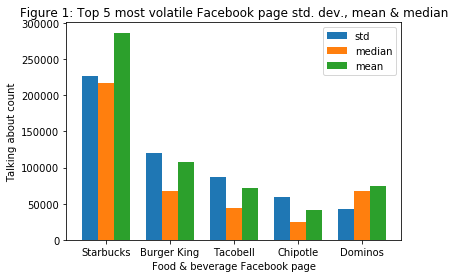
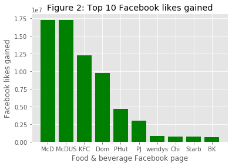

# Facebook_page_analysis
A set of data (147MB) comprising Facebook pages information such as likes, talking about count and and check-ins are analysed for food and beverages companies.

The data are filtered based on top 250 restaurant chain in US ('https://www.fsdbco.com/top-250-restaurant-chains-us-2019/')
51 Facebook pages were idenfified related to the filter.

Table 1: Top 5 most liked page in the dataset for food & beverage (USA) 
| Index | Facebook page name | Facebook likes | 
| --- | --- | --- |
| 1 | McDonalds | 78,045,025 |
| 2 | McDonaldsUS | 78,015,575 |
| 3 | KFC | 51,635,735 |
| 4 | Starbucks | 37,189,939 |
| 5 | PizzaHut | 31,513,432 |

Table 2: Top 5 least liked page in the dataset for food & beverage (USA) 
| Index | Facebook page name | Facebook likes | 
| --- | --- | --- |
| 1 | PolloTropical | 176,449 |
| 2 | flemings | 122,103 |
| 3 | GrandLuxCafe | 81,442 |
| 4 | EddieVsPrimeSeafood | 74,770 |
| 5 | Lubys | 35,593 |

Table 3: Mean, median and standard deviation of Facebook food & beverage category likes 
| Index | Facebook likes |
| --- | --- |
| median | 1.347616e+06 |
| mean | 7.963902e+06 |
| std | 1.768098e+07 |
	
The volatility of 'talking about count' is examined. The result is shown in Figure 1.

## Facebook likes examination
The trend of Facebook likes gained over the years are examined. First, the absolute gain of Facebook likes for these Facebook food & beverage pages are computed and shown in Figure 2. 

  

Note: Dom=Dominos, PHut=Pizza Hut, PJ=PapaJohnUS, Chi=Chipotle, Stab=Starbucks, BK=Burger King
The absolute **likes** gain does not take into account the existing size of the page as well as the time taken to gain the likes. In order to get a more comparable data, the **likes values are normalised** and then **divided by the time frame** taken to gain those number of likes.    
	

